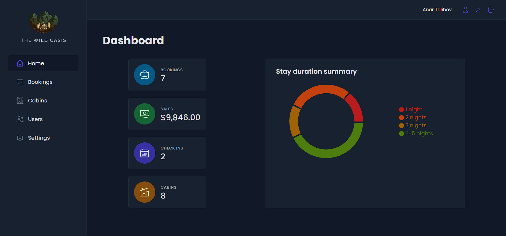

# Hotel management app

This is a React project where hotel employees can manage cabins, bookings, users and more.

You can view the project live here:
[Hotel-Management-App](https://hotelmanagementapplication.netlify.app)

### Table of Contents

- [Project-features](#project-features)
- [Technologies](#technologies)
- [References](#references)

## Project features

👤 User Authentication
- Exclusive Access: Only hotel employees can sign up.
- Login Required: Employees must be logged in to access the application.
- Profile Management: Employees can update their name and password.

🏠 Cabin Management
- Cabin Table View: View all cabins with their photo, name, capacity, price, and current discount in a tabular format.
- CRUD Operations: Create and delete cabins, including uploading cabin photos.

📝 Booking Management
- Booking Table View: View bookings with arrival/departure dates, status, paid amount, and associated cabin/guest data.
- Status Filters: Filter bookings by status — "Unconfirmed", "Checked In", "Checked Out".
- Booking Actions: Delete bookings, check guests in or out.
- Payment Handling: Manually confirm payments.

👥 Guest Info
- Detailed Guest Info: View guest data including full name, email, national ID, nationality, and country flag for easy identification.

📊 Dashboard Overview
- Key Statistics: View recent stats on bookings, sales, check-ins, and cabins.
- Stay Duration Chart: View stay duration statistics in pie chart.

⚙️ Application Settings
- Configurable Settings: Define app-wide settings like breakfast price, minimum/maximum nights per booking, and maximum guests per booking.

🌑 Dark Mode
- Dark Mode: Switch between light and dark modes for a comfortable user interface experience.

## Technologies

- 👉 Routing - React Router
- 👉 Styling - Styled Components
- 👉 Remote state management - React Query
- 👉 Ui state management - Context API
- 👉 Form management - React Hook Form
- 👉 Backend - Supabase
- 👉 Other tools - React Icons, React Hot Toast, Recharts

## References

I made this project with the help of Jonas Schmedtmann in the React course: [React course](https://www.udemy.com/course/the-ultimate-react-course/)